# Digital Badge App


## Introduction / Overview

The Digital Badge App is intended to allow Microsoft 365 Champions to apply a "Champion" badge overlay quickly and easily to their existing profile image and have it populated across their Microsoft 365 tenant. This allows for easy identification of Champions around the organization. The app provides Champion Program Manager and Champion functions.  A Champion administrator owns the Champion program within an organization and may or may not be a tenant administrator in the Microsoft 365 tenant.  

This app package is delivered as a part of the worldwide Microsoft 365 Champion program by the Microsoft Teams Customer Advocacy Group to enable modern management of your Champion program.  For more information about this program visit us at https://aka.ms/M365Champions

## How It Works

1. The current version of the Digital Badge operates as an app in Microsoft Teams that is installed locally in your tenant by your tenant administrator or any user who has the capability to side load the application. This is a cloud only Microsoft 365 solution and is not supported on premises.  Once installed it can be accessed via "+Add a tab" option at the top of the channel within a team. ***Channel > Add a tab > Digital Badge***

2. Users will need to consent and click "Accept" to allow the application to modify their profile image across all Office 365 applications.

3. The app installation process will create a SharePoint list (***Champions List***) to store all users who are eligible for a digital badge. A local administrator is responsible for maintaining this SharePoint list. This person can be the individual who manages the Champion program for the organization or his/her delegate.  Tenant administration rights are not required. All users added to this SharePoint list will have permission to apply the Digital Badge. 

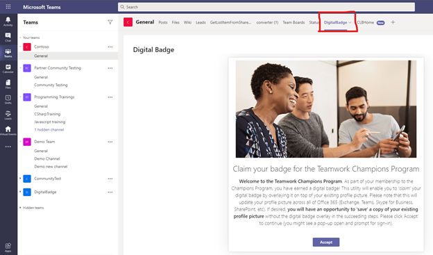

4. After the user clicks "Accept", the app will display a composite image that will look like:

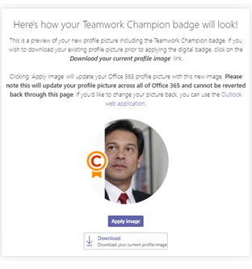

5. A successful acceptance will look like:

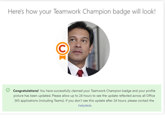

6. If a user is not included in the SharePoint list they are notified that they are not qualified for Champion Badge program at this time.

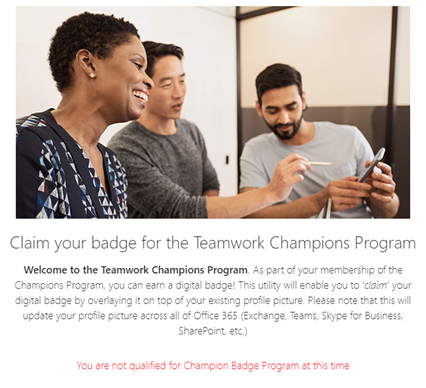

### Prerequisites

Ensure the administrator who will install the app has access to following:

*  Global or SharePoint Administrator role in the target tenant 
*  Digital Badge project in GitHub

### Install Digital Badge SPFx Package

1. Download Code / clone from GitHub.

2. To use the default configuration:
   a. Navigate to the solution folder where you cloned and locate the digital-badge.sppkg package in ***"sharepoint/solution"***.

### Customize configuration

If desired the administrator can configure the installation location including the customized site, list, and/or column(s) using following steps:

1. Update the ***"src/webparts/digitalBadge/config/siteconfig.json"*** configuration file.  Changing the values in the JSON file will customize the SharePoint list location and/or schema when it is created during deployment.


```
· inclusionPath (SharePoint inclusion path - e.g. sites or teams)

· sitename (SharePoint site name)

· list (SharePoint list for maintaining Champions)

· CName (Share Point list Column Name for Champions)
```

2. Create the SharePoint App Package.  This package will be used to deploy the application in SharePoint and Microsoft Teams. Run the below commands :

```
· gulp serve 

· gulp build

· gulp bundle --ship

· gulp package-solution –ship
```

3. Navigate to the solution folder where you cloned and locate the newly created digital-badge.sppkg package in ***"sharepoint/solution"***.

### Deploy your Package to SharePoint

1. Open SharePoint and sign in using the admininistrator account. Click on the "dots" icon in the top left corner of the banner.
  

  
2. Select Admin from the menu that appears.
  
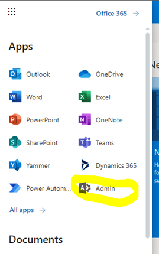
  
3. Select SharePoint from the menu that appears.  You may need to click "... Show all" for the SharePoint entry to appear.
  
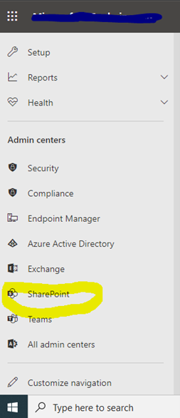
  
4. You will be directed to the SharePoint admin center.
  
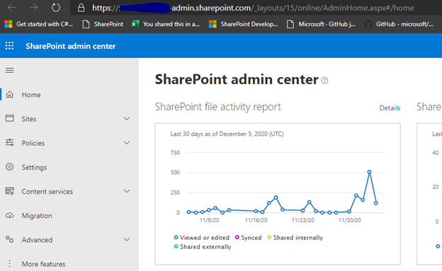

5. Click on "More features" menu item.  Locate the Apps section and click the **Open** button.
  
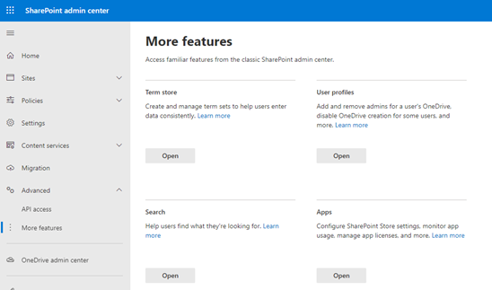

6. Click the ***App Catalog*** link.
  
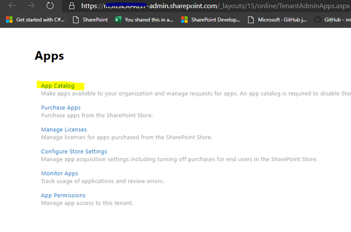

*If you do not see an app catalog available, use the instructions <a href='https://docs.microsoft.com/en-us/sharepoint/use-app-catalog#step-1-create-the-app-catalog-site-collection' target="_blank">here</a> to create a new app catalog before continuing.*

7. Click the ***Distribute apps for SharePoint*** link.


  
8. Click the ***New*** menu item

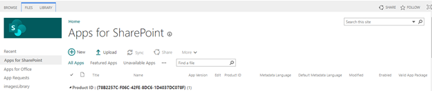
 
9. Click the ***Choose Files*** button, select the digital-badge.sppkg file you downloaded or created earlier, and click on ***OK***


 
10. A confirmation dialog is displayed. Ensure the checkbox for "Make this solution available to all sites in the organization" is chosen and click ***Deploy***.

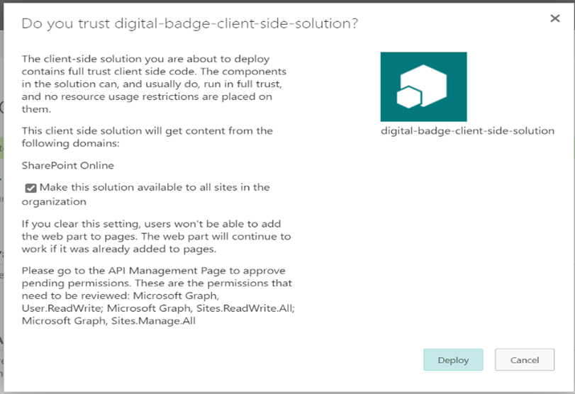
 
11. Return to the ***SharePoint admin center***. Under expand the ***Advanced*** menu in the left navigation and select ***API access***.  Select and approve all pending requests associated with ***digital-badge-client-side-solution***.

 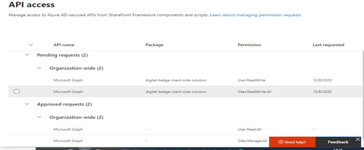
 
12. Return to app list in the App Catalog and select the ***digital-badge-client-side-solution*** app. Select the *Files* tab in the ribbon and click the ***Sync to Teams*** button.

 
 
### Add Digital Badge Tab in Teams

1. Navigate to Microsoft teams, select the Team and channel where you want to install digital badge.  Click ***Add a tab***, choose ***DigitalBadge*** from the app list, and Save. 

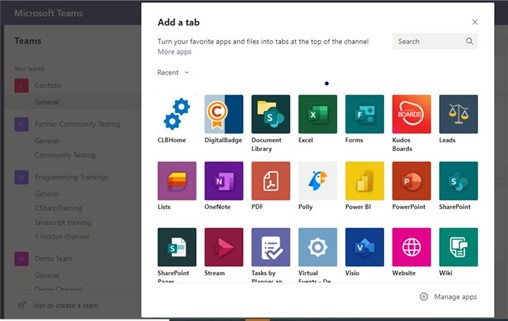
         
### Add Users to the Champions List

1. Find the ***Champion list***:

  · Navigate to the URL for the list, signing in as the administrator account when prompted.
  
    · If you are using the default configuration, this can be found at ***`https://<yourtenant>.sharepoint.com/sites/ChampionDigitalBadge/`***.
    
    · If you have customized the site configuration, navigate to ***`https://<yourtenant>.sharepoint.com/<inclusionPath>/<sitename>/`*** where <sitename> and <inclusionPath> are the values provided during customization.

  · Navigate to ***Site Contents***

  · Locate the "Champions list" used to maintain the records of all the Champions in your organization.
  
    · If you are using the default configuration, this will be called ***Champions List***.
    
    · If you have customized the site configuration, use the value of "list" provided during customization.

2. Add individual Champions to the list:

  · By default the administrator account is added to the list automatically.

  · Use the ***New*** button to add each additional user that should have access to create the digital badge.
    
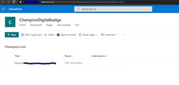

3. Grant ***READ permissions*** to the Digital Badge site:

  · Return to the site home page.
  
  · Select “Share”
   
  · Choose the users and/or groups that should have Digital Badge access.
 
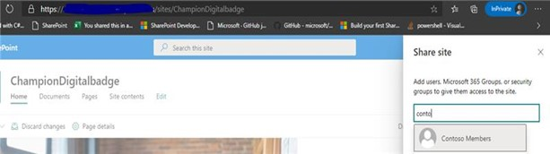

  · Share the site with Users and/or Groups with Read Permissions

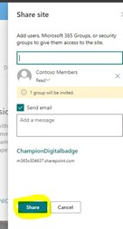

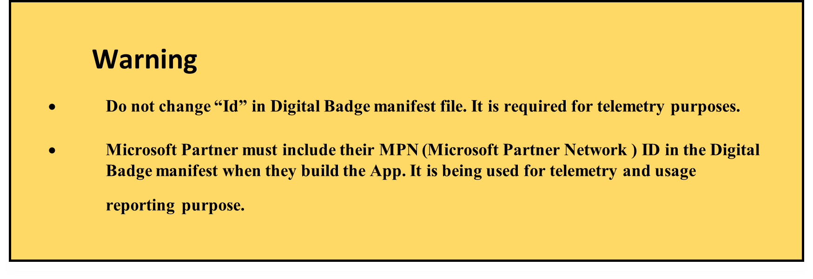

### Legal 

This app template is provided under the MIT License terms. In addition to these terms, by using this app template you agree to the following:

· You are responsible for complying with all applicable privacy and security regulations related to use, collection, and handling of any personal data by your app. This includes complying with all internal privacy and security policies of your organization if your app is developed to be sideloaded internally within your organization.

· Where applicable, you may be responsible for data related incidents or data subject requests for data collected through your app.

· Any trademarks or registered trademarks of Microsoft in the United States and/or other countries and logos included in this repository are the property of Microsoft, and the license for this project does not grant you rights to use any Microsoft names, logos or trademarks outside of this repository. Microsoft's general trademark guidelines can be found [here](https://www.microsoft.com/en-us/legal/intellectualproperty/trademarks/usage/general.aspx).

· Use of this template does not guarantee acceptance of your app to the Teams app store. To make this app available in the Teams app store, you will have to comply with the [submission and validation process](https://docs.microsoft.com/en-us/microsoftteams/platform/concepts/deploy-and-publish/appsource/publish), and all associated requirements such as including your own privacy statement and terms of use for your app.

**Contributing**

This project welcomes contributions and suggestions. Most contributions require you to agree to a Contributor License Agreement (CLA) declaring that you have the right to, and actually do, grant us the rights to use your contribution. For details, visit https://cla.microsoft.com.

When you submit a pull request, a CLA-bot will automatically determine whether you need to provide a CLA and decorate the PR appropriately (e.g., label, comment). Simply follow the instructions provided by the bot. You will only need to do this once across all repos using our CLA. This project has adopted the Microsoft Open Source Code of Conduct. For more information see the Code of Conduct FAQ or contact opencode@microsoft.com with any additional questions or comments.

### Disclaimer

THIS CODE IS PROVIDED AS IS WITHOUT WARRANTY OF ANY KIND, EITHER EXPRESS OR IMPLIED, INCLUDING ANY IMPLIED WARRANTIES OF FITNESS FOR A PARTICULAR PURPOSE, MERCHANTABILITY, OR NON-INFRINGEMENT.
